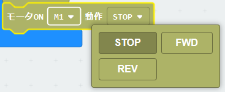
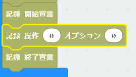
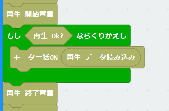

# KRCモータードライバ


## URL
project URL:  ```https://github.com/kukirobotclub/pxt-krc-motor```<BR>
上記のアドレスを拡張機能から張り付けて、拡張ブロックを導入する

## 概要
KRCのマイクロビットボードのモータドライブコントロールの拡張ブロック

・DCモーター4chまでをサポート

・ON/OFF制御とスピード制御ができる

・EEPROMに操作記録

・EEPROMの操作記録の再生


## ブロック
### 1.モーターON/OFF

制御したいモータ番号を選択<BR>

回転方向を選択<BR>

### 2.モータースピード制御

スピード制御したいモータ番号を選択<BR>

回転方向を選択<BR>
Speedは０(停止)～1023(最大速度）を入力<BR>

### 3.モーター停止

停止したいモータ番号を選択<BR>

### 4.モーター一括ON/OFF

一度に全モーターのON/OFFを行う<BR>
４つのモーターを一度に設定したいときに１行でできる<BR>
データは「モーター一括データ作成」で作成された形式<BR>

### 5.モーター一括データ作成

モーターの一括データを作成する<BR>

### 6.モーター操作記録

時間とモーター操作データをEEPROMに記録<BR>
記録開始宣言～記録終了宣言の間に、操作されるごとに記録操作を入れると、その時の操作時間とともに操作データが記録される<BR>
操作データは「モーター一括データ作成」で作成された形式<BR><BR>
※オプションは将来機能<BR>
※EEPがおかしい場合は書き込みされない<BR>
※EEPへの記録は、モーターのON/OFFのみで、スピードは記録できない<BR>
※最大記録時間は 655秒　最大記録操作数 16381<BR>

### 7.モーター操作再生

EEPROMに記録されたモーター操作記録を再生する<BR>
開始宣言でタイマーがリセットされ、再生準備ができる<BR>
再生開始宣言～再生終了宣言の間に、再生データ読み込みを行うと、操作した時間になったときに有効なデータが返され、それ以外は無効なデータが返される<BR>
直接「モーター一括ON/OFF」に渡せば良いようになっている<BR>
上記のループによる使い方が一番簡単な構成（中断とか一切考えてない仕様）<BR>
データが終わったかどうかは、再生OK？で確認する<BR><BR>
※EEPがおかしい場合はすぐに再生OK？がfalseになる<BR>


## ライセンス

GNU

## 注意点

モーターは以下のポートに接続されているものとする<BR>

・Ch1　P8,P12

・Ch2　P13,P14

・Ch3　P15,P16

・Ch4　P1,P2

よってほかの用途でポートを使う場合は、併用できない<BR>