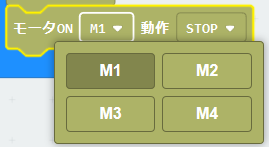
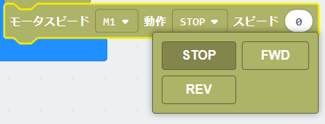
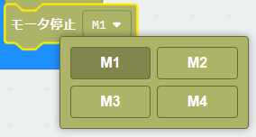

# KRCモータードライバ


## URL
project URL:  ```https://github.com/kukirobotclub/pxt-krc-motor```

## 概要
KRCのマイクロビットボードのモータドライブコントロールの拡張ブロック

DCモーター4chまでをサポート

ON/OFF制御とスピード制御ができる

## ブロック
### 1.モーターON/OFF

制御したいモータ番号を選択


回転方向を選択

### 2.モータースピード制御

スピード制御したいモータ番号を選択


回転方向を選択
Speedは０(停止)～1023(最大速度）を入力

### 3.モーター停止

停止したいモータ番号を選択


## ライセンス

GNU

## 注意点

モーターは以下のポートに接続されているものとする

・Ch1　P8,P12

・Ch2　P13,P14

・Ch3　P15,P16

・Ch4　P1,P2

よってほかの用途でポートを使う場合は、併用できない
